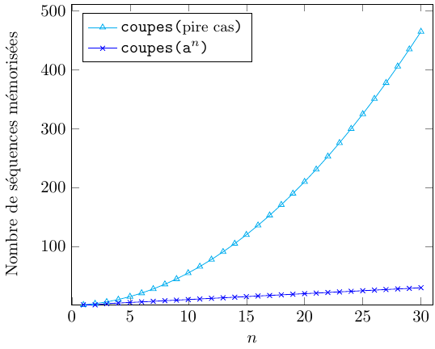
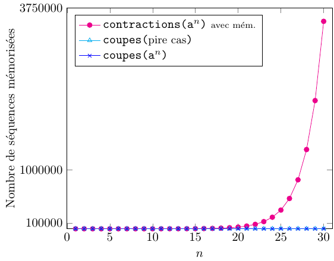
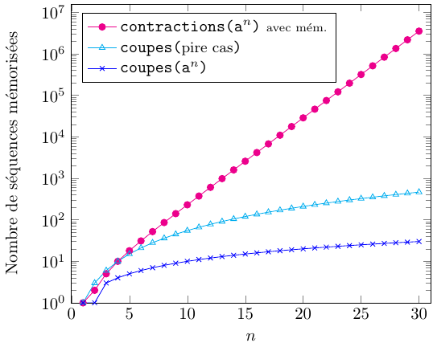
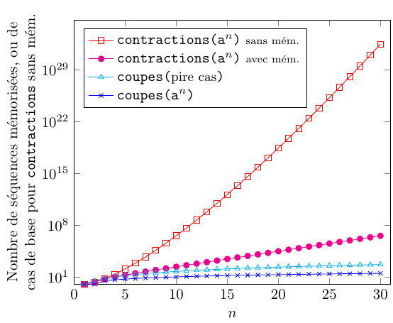

# Parenthésage: approches récursives

## Approche par contractions

Voici une première approche récursive:

- on balaie la séquence ```p``` et on «contracte» deux éléments consécutifs;
- on répète récursivement sur la séquence obtenue pour chaque contraction;
- lorsque la séquence devient un singleton, on vérifie si c'est ```x```.

En terme de pseudocode, cela s'exprime comme suit:

```
contractions(p, T):
  si |p| = 1:
    retourner (p[1] = x)
  sinon:
    pour i ∈ [1..|p|-1]:
      gauche ← p[1 : i-1]
      centre ← T[p[i], p[i+1]]
      droite ← p[i+2 : |p|]

      si contractions(gauche + centre + droite, T):
        retourner vrai

    retourner faux
```

Cette approche fonctionne, mais est inefficace car elle essaie systématiquement tous les parenthésages.
Le nombre de parenthésages est au moins exponentiel. En effet, par ex. chaque bloc de
trois éléments consécutifs ```p[i] p[i+1] p[i+2]``` peut être parenthésé de deux façons:
```(p[i] ⊗ (p[i+1] ⊗ p[i+2]))``` ou ```((p[i] ⊗ p[i+1]) ⊗ p[i+2])```. Ainsi, il y a au moins 2<sup>n/3</sup> parenthésages.
La complexité est en fait pire et correspond plus précisément aux
[nombres de Catalan](https://fr.wikipedia.org/wiki/Nombre_de_Catalan).

## Approche par contractions 2.0: avec mémoïsation

Comme la première approche est inefficace, il est tentant d'ajouter une forme de mémoïsation.
Plus précisément, chaque fois qu'on traite une séquence, on mémorise le résultat et on évite de le recalculer
dans le futur:

```
contractions_avecmem(p, T):
  mem ← []

  contractions_avecmem'(s):
    si s ∉ mem:
      si |s| = 1:
        mem[s] ← (s[1] = x)
      sinon:
        peut_engendrer ← faux

        pour i ∈ [1..|s|-1]:
          gauche ← s[1 : i-1]
          centre ← T[s[i], s[i+1]]
          droite ← s[i+2 : |s|]

          si contractions_avecmem'(gauche + centre + droite):
            peut_engendrer ← vrai
            quitter la boucle

        mem[s] ← peut_engendrer

    retourner mem[s]

  retourner contractions'(p)
```

Cette approche se bute aussi à une complexité exponentielle. En effet,
considérons cette table de multiplication ```T```:

|⊗|a|b|c|x|
|-|-|-|-|-|
|**a**|b|a|c|x
|**b**|b|a|c|x
|**c**|b|a|c|x
|**x**|b|a|c|x

Considérons la séquence ```a```<sup>*n*</sup>, c'est-à-dire celle constituée du symbole ```a``` répété
*n* fois. Remarquons que ```a ⊗ (a ⊗ a) = a``` et ```(a ⊗ a) ⊗ a = b```. Ainsi, chaque triplet consécutif
peut engendrer ```a``` ou ```b```. Cela signifie qu'à travers des contractions sur ```a```<sup>*n*</sup>, on
peut engendrer 2<sup>n/3</sup> séquences distinctes de taille n/3, ce qui est exponentiel.

## Approche par coupes avec mémoïsation

On peut plutôt procéder par «coupes» successives:

- on essaie toutes les «coupes» (gauche, droite) de la séquence ```p```;
- on obtient les valeurs qui peuvent être engendrées des deux côtés de la coupe;
- on calcule toutes les combinaisons possibles (au plus 4·4 = 16 par coupe);
- à la toute fin, on vérifie si ```x``` peut être engendré (par l'appel initial).

De plus, afin d'éviter une explosion, on utilise la mémoïsation
afin de ne pas retraiter les sous-séquences déjà traitées. On obtient ainsi ce pseudocode:

```
coupes(p, T):
  mem ← []

  coupes'(s):
    si s ∉ mem:
      si |s| = 1:
        mem[s] ← {s[1]}                                                                                                
      sinon:
        valeurs ← ∅

        pour i ∈ [2..|s|]
          gauche  ← coupes'(s[1 : i-1])
          droite  ← coupes'(s[i : |s|])
          valeurs ← valeurs ∪ {T[x, y] : x ∈ gauche, y ∈ droite}

        mem[s] ← valeurs

    retourner mem[s]

  retourner x ∈ coupes'(p)
```

Comme il y a au plus 1 + 2 + ... + n ∈ O(n²) sous-séquences contiguës et que
chacune doit exécuter la boucle «pour», cela mène à un temps d'exécution de O(n³).
La différence fondamentale entre cette approche et la précédente est qu'on
ne crée *jamais* de sous-séquence qui n'existait pas au départ. Cela évite
donc toute forme d'explosion.

## Comparaison des approches

Reconsidérons la séquence ```a```<sup>*n*</sup> et la table ```T``` précédente.
Cette séquence possède exactement *n* sous-séquences contiguës: une pour chaque taille.
Ainsi, sur cette entrée, le nombre de séquences mémorisées par l'approche par coupes est linéaire,
ce qui est bien mieux que le pire cas de *n(n+1)/2*:



En comparaison, l'algorithme par contractions avec mémoïsation mémorise un
nombre exponentiel de séquences:



En fait, la complexité croît si rapidement qu'on distingue mal les deux autres
courbes. En utilisant un axe y logarithmique, on perçoit mieux la différence:



Finalement, l'approche par contraction sans mémoïsation mène à un temps
d'exécution encore plus dramatique. Voici le nombre de fois que son
cas de base (```|p| = 1```) est atteint:



Ici, l'axe y est aussi logarithmique, donc l'écart est abyssal!

# Parenthésage: approche itérative

L'approche par coupes avec mémoïsation s'implémente également de façon ascendante. On remplit
un tableau ```M``` où ```M[i, j]``` indique les éléments qu'on peut obtenir en parenthésant la
sous-séquence ```p[i : j]```. On remplit ce tableau ligne à ligne à partir du bas, et colonne à colonne
de gauche à droite:

```
coupes_iter(p, T):
  M ← [(i, j) ↦ ⊥ : i, j ∈ [1..|p|]]

  pour i ∈ [1..|p|]:
    M[i, i] ← {p[i]}

  pour i ∈ [|p|..1]:
      pour j ∈ [i+1..|p|]:
          M[i, j] ← ∅

          pour k ∈ [i..j-1]:
              M[i, j] ← M[i, j] ∪ {T[x, y] : x ∈ M[i, k], y ∈ M[k + 1, j]}

  retourner x ∈ M[1, n]
```

Considérons la séquence ```p = cbca``` et cette table de multiplication ```T```:

|⊗|a|b|c|x|
|-|-|-|-|-|
|**a**|a|b|x|a
|**b**|b|b|a|a
|**c**|x|a|b|c
|**x**|a|a|c|b

L'algorithme mène au tableau ```M``` ci-dessous. En particulier, la case
```M[1, 4]``` est obtenue grâce aux paires de cases marquées par des symboles.
On obtient ainsi ```M[1, 4] = {🔸 ⊗ 🔹, 📙 ⊗ 📘, 🧡 ⊗ 💙} = {c ⊗ a, a ⊗ x, x ⊗ a}
= {x, a, a} = {a, x}```.

| |1|2|3|4|
|-|-|-|-|-|
|**1**|{c}<sup>🔸</sup>|{a}<sup>📙|{x}<sup>🧡</sup>|{a, x}
|**2**|⊥|{b}|{a}|{a}<sup>🔹</sup>
|**3**|⊥|⊥|{c}|{x}<sup>📘</sup>
|**4**|⊥|⊥|⊥|{a}<sup>💙</sup>

Remarquons que cette approche, implémentée de cette façon, fonctionne en temps Θ(n³) dans le pire _et_ meilleur cas, alors
que l'implémentation récursive fonctionne en temps Θ(n³) dans le pire cas et Θ(n²) dans le
meilleur cas.

# ★ Analyse de l'approche avec coupes sans mémoïsation

En classe (A23), une personne m'a demandé comment analyser l'approche récursive avec coupe
_sans_ mémoïsation. Faisons cette analyse. Tout d'abord, voici le pseudocode à considérer:

```
coupes_sansmem(p, T):
  coupes_sansmem'(s):
    si |s| = 1:
      retourner {s[1]}                                                                                                
    sinon:
      valeurs ← ∅

      pour i ∈ [2..|s|]
        gauche  ← coupes_sansmem'(s[1 : i-1])
        droite  ← coupes_sansmem'(s[i : |s|])
        valeurs ← valeurs ∪ {T[x, y] : x ∈ gauche, y ∈ droite}

      retourner valeurs

  retourner x ∈ coupes_sansmem'(p)
```

Analysons _f(n)_ définie comme étant le nombre d'appels récursifs effectués par l'appel initial ```coupes_sansmem'(p)```,
où _n_ est la taille de ```p```. Nous avons _f(1) = 0_ car aucun appel n'est effectué au cas de base.
En inspectant la boucle du cas général, on remarque que:

```
f(n) = (2 + f(1) + f(n-1)) + (2 + f(2) + f(n-2)) + … + (2 + f(n-1) + f(1)),
```

que nous pouvons réécrire comme suit:

```
f(n) = 2·(n-1) + 2·(f(1) + f(2) + … + f(n-1)).
```

Nous cherchons donc à trouver une forme close à une récurrence. Toutefois, celle-ci n'est pas directement dans
une forme couverte en classe. Remarquons que pour tout _n ≥ 3_, nous avons:

```
f(n) =  2·(n-1) + 2·(f(1) + f(2) + … + f(n-1))                      [par déf. de f(n)]
     = [2·(n-2) + 2·(f(1) + f(2) + … + f(n-2))] + [2 + 2·f(n-1)]    [en réécrivant la somme]
     = f(n-1) + [2 + 2·f(n-1)]                                      [par déf. de f(n-1)]
     = 3·f(n-1) + 2.
```

Ainsi, nous avons une récurrence linéaire non homogène:

```
f(n) = 0             si n = 1,
       2             si n = 2,
       3·f(n-1) + 2  sinon.
```

Nous pouvons maintenant trouver une forme close à _f_. Son polynôme caractéristique est _x - 3_. De plus, comme la
récurrence est non homogène, il faut lui multiplier _x - 1_. Nous obtenons donc le polynôme _(x - 3)(x - 1)_ dont
les racines sont _3_ et _1_. La forme close de _f_ est ainsi de la forme _c₁·3<sup>n</sup> + c₂_. Afin d'identifier
les constantes, nous pouvons considérer ce système d'équations:

```
c₁·3¹ + c₂ = 0
c₁·3² + c₂ = 2
```

qui se réécrit

```
3·c₁ + c₂ = 0
9·c₁ + c₂ = 2
```

Nous avons donc _c₁ = 1/3_ et _c₂ = -1_, ce qui mène à _f(n) = ⅓·3<sup>n</sup> - 1 = 3<sup>n-1</sup> - 1_.

Par conséquent, nous avons _f ∈ Θ(3ⁿ)_, ce qui n'est pas polynomial.

# ⭐⭐ Analyse de l'approche par contractions sans mémoïsation

Reconsidérons maintenant la toute première approche proposée:

```
contractions(p, T):
  si |p| = 1:
    retourner (p[1] = x)
  sinon:
    pour i ∈ [1..|p|-1]:
      gauche ← p[1 : i-1]
      centre ← T[p[i], p[i+1]]
      droite ← p[i+2 : |p|]

      si contractions(gauche + centre + droite, T):
        retourner vrai

    retourner faux
```

Analysons _f(n)_ définie comme étant le nombre d'appels récursifs effectués par l'appel initial à ```contractions(p, T)```,
où _n_ est la taille de ```p```. Nous avons _f(1) = 0_ car aucun appel n'est effectué au cas de base.
En inspectant la boucle du cas général, on remarque que:

```
f(n) = (n-1) · (1 + f(n-1))
     = (n-1) · f(n-1) + (n-1)
```
car il y a _n - 1_ appels sur des sous-séquences de taille _n-1_. Cette récurrence ressemble à la factorielle.
Montrons par induction que _f(n) ≥ (n-1)!_ pour tout _n ≥ 2_. Nous avons _f(2) = 1 = 1!_. Soit _n > 2_. Nous avons

```
f(n) = (n-1) · f(n-1) + (n-1)    [par déf. de f(n)]
     ≥ (n-1) · (n-2)! + (n-1)    [par hypothèse d'induction]
     = (n-1)! + (n-1)
     ≥ (n-1)!                    □
```

Par conséquent, nous avons _f ∈ Ω((n-1)!)_, ce qui n'est ni polynomial, ni exponentiel.

On peut également montrer que _f(n) ≤ n!_ pour tout _n ≥ 2_, ce qui implique que _f ∈ O(n!)_.
En effet, nous avons _f(2) = 1 = 1!_, et pour _n > 2_:

```
f(n) = (n-1) · f(n-1) + (n-1)       [par déf. de f(n)]
     ≤ (n-1) · (n-1)! + (n-1)       [par hypothèse d'induction]
     = n · (n-1)! - (n-1)! + (n-1)
     = n! + (n-1) - (n-1)!
     ≤ n!                           [car (n-1) ≤ (n-1)!]      □
