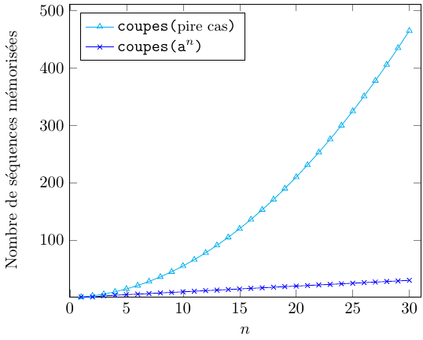
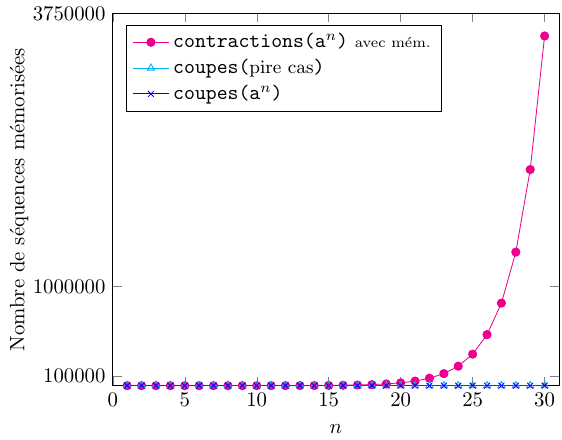
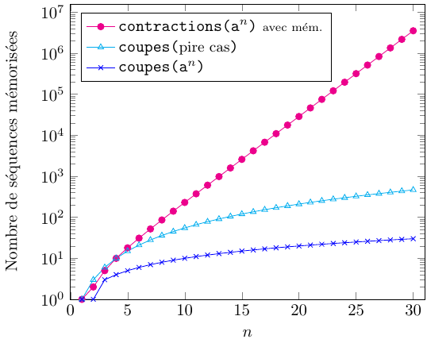
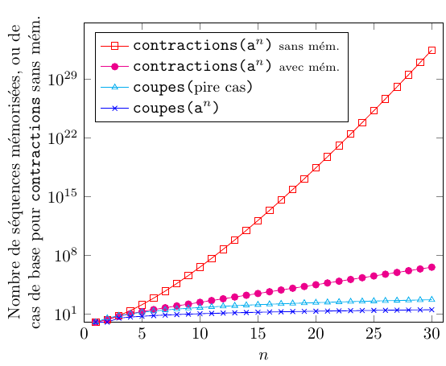

# Parenthésage: approches récursives

## Approche par contractions

Voici une première approche récursive:

- on balaie la séquence ```p``` et on «contracte» deux éléments consécutifs;
- on répète récursivement sur la séquence obtenue pour chaque contraction;
- lorsque la séquence devient un singleton, on vérifie si c'est ```x```.

En terme de pseudocode, cela s'exprime comme suit:

```
contractions(p, T):
  si |p| = 1:
    retourner (p[1] = x)
  sinon:
    pour i ∈ [1..|p|-1]:
      gauche ← s[1 : i-1]
      centre ← T[p[i], p[i+1]]
      droite ← p[i+2 : |p|]

      si contractions(gauche + centre + droite):
        retourner vrai

    retourner faux
```

Cette approche fonctionne, mais est inefficace car elle essaie systématiquement tous les parenthésages.
Le nombre de parenthésages est plus qu'exponentiel. En effet, par ex. chaque bloc de
trois éléments consécutifs ```p[i] p[i+1] p[i+2]``` peut être parenthésé de deux façons:
```(p[i] ⊗ (p[i+1] ⊗ p[i+2]))``` ou ```((p[i] ⊗ p[i+1]) ⊗ p[i+2])```. Ainsi, il y a au moins 2<sup>n/3</sup> parenthésages.
La complexité est en fait pire et correspond plus précisément aux
[nombres de Catalan](https://fr.wikipedia.org/wiki/Nombre_de_Catalan).

## Approche par contractions 2.0: avec mémoïsation

Comme la première approche est inefficace, il est tentant d'ajouter une forme de mémoïsation.
Plus précisément, chaque fois qu'on traite une séquence, on mémorise le résultat et on évite de le recalculer
dans le futur:

```
contractions_avecmem(p, T):
  mem ← []

  contractions'(s):
    si s ∉ mem:
      si |s| = 1:
        mem[s] ← (s[1] = x)
      sinon:
        peut_engendrer ← faux

        pour i ∈ [1..|s|-1]:
          gauche ← s[1 : i-1]
          centre ← T[s[i], s[i+1]]
          droite ← s[i+2 : |s|]

          si contractions'(gauche + centre + droite):
            peut_engendrer ← vrai
            quitter la boucle

        mem[s] ← peut_engendrer

    retourner mem[s]

  retourner contractions'(p)
```

Cette approche se bute aussi à une complexité exponentielle. En effet,
considérons cette table de multiplication ```T```:

|⊗|a|b|c|x|
|-|-|-|-|-|
|**a**|b|a|c|x
|**b**|b|a|c|x
|**c**|b|a|c|x
|**x**|b|a|c|x

Considérons la séquence ```a```<sup>*n*</sup>, c'est-à-dire celle constituée du symbole ```a``` répété
*n* fois. Remarquons que ```a ⊗ (a ⊗ a) = a``` et ```(a ⊗ a) ⊗ a = b```. Ainsi, chaque triplet consécutif
peut engendrer ```a``` ou ```b```. Cela signifie qu'à travers des contractions sur ```a```<sup>*n*</sup>, on
peut engendrer 2<sup>n/3</sup> séquences distinctes de taille n/3, ce qui est exponentiel.

## Approche par coupes

On peut plutôt procéder par «coupes» successives:

- on essaie toutes les «coupes» (gauche, droite) de la séquence ```p```;
- on obtient les valeurs qui peuvent être engendrées des deux côtés de la coupe;
- on calcule toutes les combinaisons possibles (au plus 4·4 = 16 par coupe);
- à la toute fin, on vérifie si ```x``` peut être engendré (par l'appel initial).

De plus, afin d'éviter une explosion, on utilise la mémoïsation
afin de ne pas retraiter les sous-séquences déjà traitées. On obtient ainsi ce pseudocode:

```
coupes(p, T):
  mem ← []

  coupes'(s):
    si s ∉ mem:
      si |s| = 1:
        mem[s] ← {s[1]}                                                                                                
      sinon:
        valeurs ← ∅

        pour i ∈ [2..|s|-1]
          gauche  ← coupes'(s[1 : i-1])
          droite  ← coupes'(s[i : |s|])
          valeurs ← valeurs ∪ {T[x, y] : x ∈ gauche, y ∈ droite}

        mem[s] ← valeurs

    retourner mem[s]

  retourner x ∈ coupes'(p)
```

Comme il y a au plus 1 + 2 + ... + n ∈ O(n²) sous-séquences contiguës et que
chacune doit exécuter la boucle «pour», cela mène à un temps d'exécution de O(n³).
La différence fondamentale entre cette approche et la précédente est qu'on
ne crée *jamais* de sous-séquence qui n'existait pas au départ. Cela évite
donc toute forme d'explosion.

## Comparaison des approches

Reconsidérons la séquence ```a```<sup>*n*</sup> et la table ```T``` précédente.
Cette séquence possède exactement *n* sous-séquences contiguës: une pour chaque taille.
Ainsi, sur cette entrée, le nombre de séquences mémorisées par l'approche par coupes est linéaire,
ce qui est bien mieux que le pire cas de *n(n+1)/2*:



En comparaison, l'algorithme par contractions avec mémoïsation mémorise un
nombre exponentiel de séquences:



En fait, la complexité croît si rapidement qu'on distingue mal les deux autres
courbes. En utilisant un axe y logarithmique, on perçoit mieux la différence:



Finalement, l'approche par contraction sans mémoïsation mène à un temps
d'exécution encore plus dramatique. Voici le nombre de fois que son
cas de base (```|p| = 1```) est atteint:



Ici, l'axe y est aussi logarithmique, donc l'écart est abyssal!
